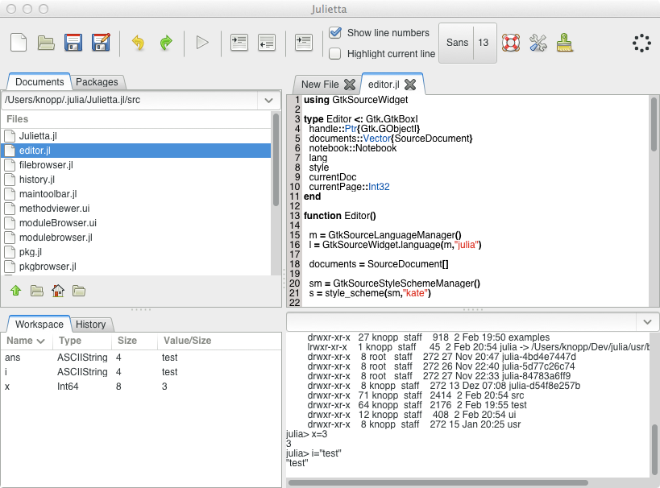

Julietta - An IDE for Julia
============================

Julietta is an integrated developement environment (IDE) for the programming language Julia. It is written in Julia using Gtk.jl. In its current form Julietta is a prototype and should not be used for real developement as several thing are not yet implemented (and due to several bugs).

## Installation

Currently it is a lot complicated to get Julietta running. Here is a list of instructions:

- Install Gtk.jl from my "listView" branch: https://github.com/tknopp/Gtk.jl/tree/listView
- Install GtkSourceWidget.jl: https://github.com/tknopp/GtkSourceWidget.jl

Furthermore Julietta requires the following Julia packages to be installed: REPLCompletions, Winston 

The complicated part is not the installation of the Julia packages (using Pkg.clone) but the installation of the dependencies. Under linux this should be most simple as the libraries Gtk+ and GtkSourceView are part of the distributions package manager.

## Running Julietta

julia -F PATH_To_Julietta/src/run_julietta.jl

## Licence

Julietta is licensed under the GPLv3. For code conributions: As the original author of this work I want to keep right to
spin off a commercial version of this software.

